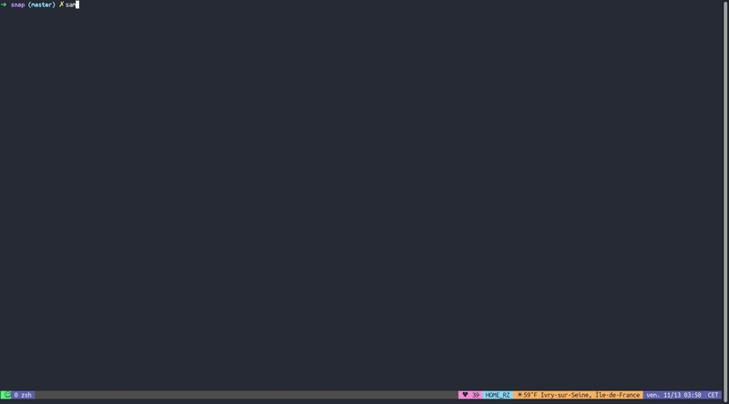

# sam


sam is a command line tool that allows you to define and manage 
templates of complex command line commands and let's chose 
template values through a command line argument.

Let's take an example, you are building an application and you 
would like to interract with a dockerized service that is running 
on your local machine to get some metrics. if you service exposes 
metrics through http, a typical call would look like:

```sh
curl http://{{container_ip}}:{{ container_port }}/metrics
```
In this setup the `{{container_ip}}` and `{{container_port}}` are dynamic. 

You will most likely have to run other commands to run them. The workflow 
might look as follow : 

1. Select a `{{container}}` from the running ones using 
```sh
docker ps --format="{{.ID}}\t{{.Names}}"
```
2. Run a command to get `{{container_ip}}` and `{{container_port}}`, most likely:
```sh 
docker inspect {{container}}
```
3. run the curl command described above. 

with sam you can configure such a process as follow : 
```yaml
- name: container
  desc: the id of a docker a runing container
  from_command: 'docker ps --format="{{.ID}}\t{{.Names}}"'

- name: container_ip
  desc: the ip address of a runing container
  from_command: 'docker inspect {{container}} |jq ''.[0]["NetworkSettings"]["IPAddress"]''|sed ''s/"//g'''

- name: container_port
  desc: the ports exposed by the container
  from_command: 'docker inspect {{ container }}|jq ''.[0]["NetworkSettings"]["Ports"] | keys''|awk -F''/'' ''/"/ {print $1}''|sed ''s/ *"//g'''
```

then if you want to run:
```sh
curl http://{{container_ip}}:{{ container_port }}/metrics
```

sam will figure out the dependency graph on his own and for each step described above 
sam will generate a small terminal user interface to let you select 
the values you want.

## Getting started :

Run `cargo run run` on the root of this repository to see a demo. 

You can also take a look at my own configuration here [r-zenine/oneliners](https://github.com/r-zenine/oneliners)

## Installing sam
You can download binaries for `linux` and `macos` from the release page. 
You can also use a package manager : 

### MacOS with homebrew: 
```bash
brew tap r-zenine/sam
brew install sam
```
## How to configure sam:
Fist, you want to start by creating a repository that will hold your scripts and aliases. 
Ideally, we recommend it's stucture to be as follow : 
```bash
aliases_directory
-------------------
        ├── aliases.yaml
        ├── vars.yaml
        ├── docker # your docker related alias for example
        │   ├── aliases.yaml
        │   └── vars.yaml
        └─── kubernetes # your kubernetes related aliases
            ├── aliases.yaml
            └── vars.yaml
```
Once it's done, you can continue by editing a configuration file in `$HOME/.sam_rc.toml`
that should look as follow: 

```toml
root_dir=["./examples/oneliners/", ".sam"] # the locations of your `aliases_directory`
# the time in seconds for which sam will keep the output of
# a from_command var in it's internal cache
ttl=1800 

# Arbitrary key value pairs
# You can refer to the keys/value pairs defined below 
# as if they were environment variables
PAGER_OPT="-p -v"
```

### Aliases:
The `aliases.yaml` file can look like this : 
```yaml
- name: echo_hello
  desc: echo hello
  alias: echo hello

- name: list_stuff
  desc: list current directory. 
  alias: [[ echo_hello ]] && cd {{directory}} && {{pager}} $(PAGER_OPT) {{file}} 
```
You can use the `{{ variable }}` syntax to refer to variables defined in your `vars_file`

You can use the `[[ ns::alias ]]` syntax to insert the content of an alias in another one.

`sam` will first prompt your for a choice for each dependant `variable`. Once this is done, it will replace each `variable` with it's corresponding choice and run the resulting command.

### Variables : 
In your `vars_file`, you can define variables. Variables can either have a static list of choices or can get their choices dynamically by running a command. The `from_command` option expects one choice per line in the output command. Each line is split by tab (\t) to extract the value and its description.

```yaml
- name: directory
  desc: an example variable
  choices:
    - value: /etc/default
      desc: etc default directory
    - value: /etc
      desc: etc directory

- name: pager
  desc: the pager tool to use
  choices: 
    - value: less
      desc: use less
    - value: cat
      desc: use cat


- name: file
  desc: file selection
  from_command: ls -1 {{ directory }}
```

## Keybindings 

while selecting choices for variables, you can use 

* Ctrl-s to select multiple values
* Ctrl-a to select all values
